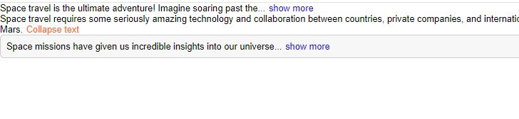

---

# TextExpander

**TextExpander** is a reusable React component for expanding and collapsing text. Customize word limits, button text, colors, and more.

## Features
- Customizable word limit for collapsed view.
- Dynamic expand/collapse button text.
- Change button color and apply custom styles.
- Control default expansion state.

## Installation
1. Clone the repo:
   ```bash
   git clone https://github.com/yourusername/TextExpander.git
   ```
2. Install dependencies:
   ```bash
   npm install
   ```

## Usage
Import and use the component in your project:
```jsx
import TextExpander from './TextExpander';

<TextExpander collapsedNumWords={20} expandButtonText="Show more" collapseButtonText="Show less">
    Your long text here...
</TextExpander>
```

## Props
| Prop                | Type      | Default    | Description                          |
|---------------------|-----------|------------|--------------------------------------|
| `collapsedNumWords` | `number`  | `10`       | Words to show when collapsed.        |
| `expandButtonText`  | `string`  | `show more`| Button text when collapsed.          |
| `collapseButtonText`| `string`  | `show less`| Button text when expanded.           |
| `buttonColor`       | `string`  | `#1f09cd`  | Color of expand/collapse button.     |
| `expanded`          | `boolean` | `false`    | Initially expanded or collapsed.     |
| `className`         | `string`  | `null`     | Additional CSS class.                |

---

# TextExpander


